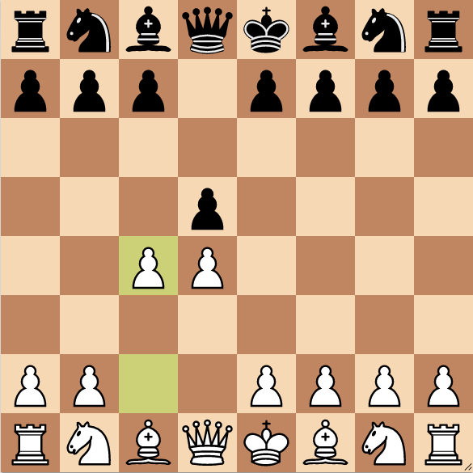
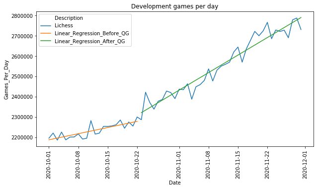
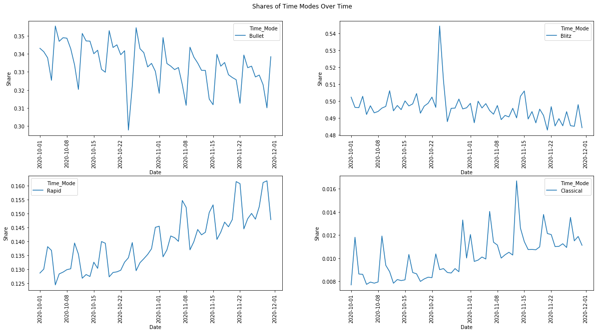
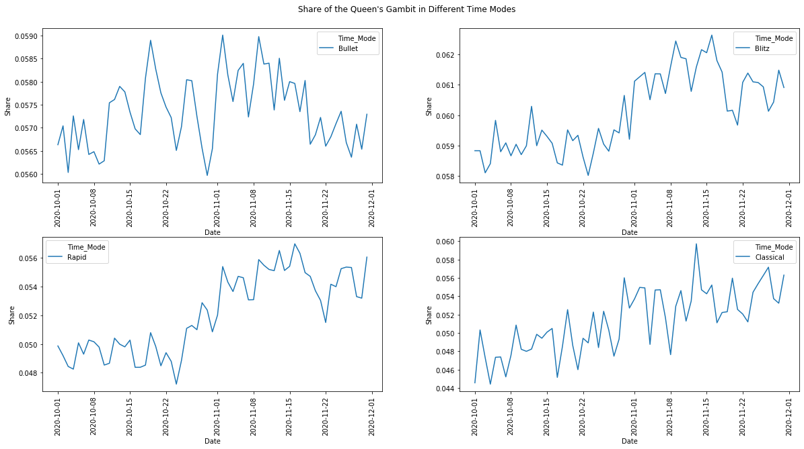
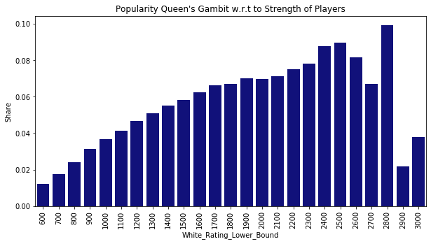

# Netflix' Queen's Gambit and Its Impact on Online Chess

Introduction:
------------

I learned chess when I was five years old. It didn't take long for me to beat my father and brother. Later on, I joined the local chess club, became an above average player and the game never lost its fascinating character to me. Nevertheless, in my opinion chess always had the reputation of being an activity mostly for nerds.

But in the last year things changed noticeably. Chess, especially online chess gained lots of popularity. In my opinion, there are two events responsible for this development. At first, COVID-19. People played chess online instead face to face. Moreover, very strong players like the world champion Magnus Carlsen started their own online tournaments that attracted public attention. The second reason is Netflix' drama series "The Queen's Gambit". This series is about the orphan Beth who tries to become the best chess player in the world, but also struggles with drug addiction. The name Queen's Gambit comes from a popular chess opening, which is depicted above.

Here, I want to investigate the impact of Queen's Gambit on online chess by analyzing games played on [Lichess](https://lichess.org).

Lichess is one of the most popular platforms for online chess with more than 100.000 players online at the same time and also lots of the world's top players like Magnus Carlsen play there regularly. Moreover, Lichess offers the opportunity to play several different chess variants like *Chess960*, *Crazyhouse* ... and *time modes*.

When you play chess you usually use a chess clock. Each player has a main time and an increment. E.g., the time control 180+2 means, that each player has 180 seconds for the entire game and after each move he receives addional two seconds. The increment has the effect that a player does not run out of time in the end. In the analysis we will consider the time modes *Bullet*, *Blitz*, *Rapid* and *Classical*. In Bullet each player has less than three minutes for the first 40 moves. This is a very fast time mode. To play sound chess in Bullet you have to be a very strong chess player. Blitz is the most popular time mode: Here each player has at most 8 minutes for the first 40 moves. Rapid and Classical are slower time modes, in which each player has less than or at least 25 minutes for the first 40 moves. From my personal experience stronger players prefer playing Bullet or Blitz.

Outline:
------------
We will consider the following questions to investigate the impact of "The Queen's Gambit" on online chess:
-	How did the number of games played develop?
-	Do we observe a change in shares of time modes? This would indicate a change in the mixture of players playing on Lichess.
-	Do we also observe a boost of the popularity of the eponymous chess opening Queen's Gambit?

Procedure:
-------------
All games played on Lichess are available on https://database.lichess.org/. Netflix' Queen's Gambit was published on the 23rd of October. I will analyze all games played on Lichess in October and November 2020. That's a lot of data. Unpacking the data from only these two months yields text data of more than 250 GB.

Before being able to analyze the data, several data wrangling steps must be performed: The games are stored in the pgn-format. This is a format which is usually used to store chess games in databases. Therefore, I do some parsing beforehand. Then, I store the revelevant features for the analysis in a csv-file. Unfortunately, these csv-files are still very large. Hence, I do not use pandas at this point to process the csv-files, but again we go through the files line by line. Then, we count which games belong to clusters that are useful for our analysis. This way we obtain a compressed dataframe which contains all relevant information for our analysis.

Analysis:
------------
Now, we have everything prepared to consider the questions given in the introduction. We start with the development of played games over time. The series was published on the 23rd of October. Do we see a significant change in the number of daily played games on Lichess? The answer is definitely yes as the following plot shows.

When we look at the linear interpolation of games played before and after the release, we observe a huge difference. Before the release we had a daily increase of approximately 4.300 games per day. After the release there is a daily increase of approximately 12.300 games per day. Moreover, there is an enormous rise in games played on 24th of October.

Now, let's take a closer look at the development of the shares of the time modes. From my personal experience weaker players prefer Rapid and Classical - as I already mentioned. That's not surprising since beginner usually have to think longer about their moves. We have seen that the number of games played increased significantly after the release of "The Queen's Gambit". In my opinion it is likely that this increase is caused by many beginners that started to play chess. If this assumption is true, then we should observe that the shares of Bullet and Blitz decrease, but the shares of Rapid and Classical increase. Is this right?

It seems that I'm not mistaken. But we observe a huge outlier in Blitz on the 24th of October. At the day after the release the share of games played in Blitz mode increased dramatically. I think that many new players started playing on Lichess at this day and started playing Blitz since this is the most popular time mode. But after a couple of games they might have realized that this time mode is too fast for them in the beginning.

We have seen that the Netflix series had clearly an impact on the number of games played on Lichess and also on the mixture of time modes. But does also the opening Queen's Gambit gain more popularity? The answer is yes, but the effect is very small.

Why is the effect only so small? Playing sophisticated openings like the Queen's Gambit requires some sound knowledge about chess. Therefore, many of the new players won't play this opening. The following chart underlines this: The share of the Queen's Gambit increases with the strength of the white player.

Summary and further questions:
------------------------
We investigated the impact of Netflix' Queen's gambit on online chess by analyzing the games played on the online platform Lichess in October and November 2020. We have seen that we can observe a remarkable effect. Moreover, we noticed that there also exists an impact on the shares of different time modes. My hypothesis is that the reason is a large number of beginners joining Lichess at this point in time. But it would be worth considering this point in more detail, e.g., using the Lichess API to evaluate profile data of each player.

Moreover, it would be interesting to extend the above analysis to the entire year 2020 to measure the effect of COVID-19 in more detail. I would expect that there exists another dramatic increase in daily games in March and April.