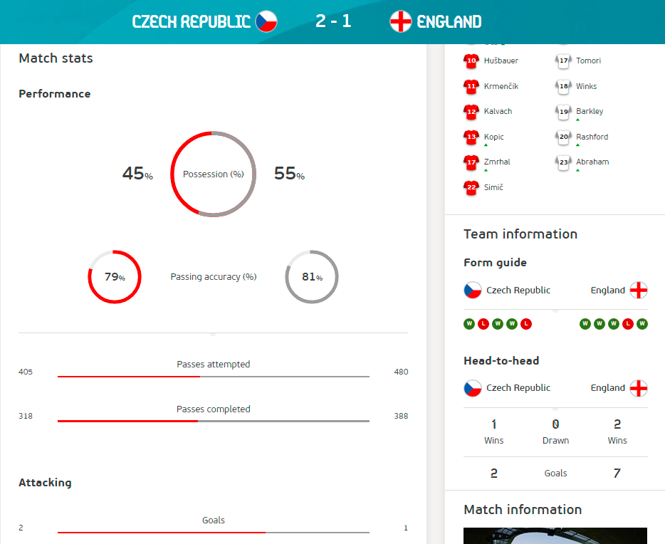
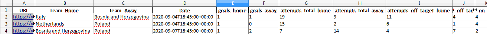
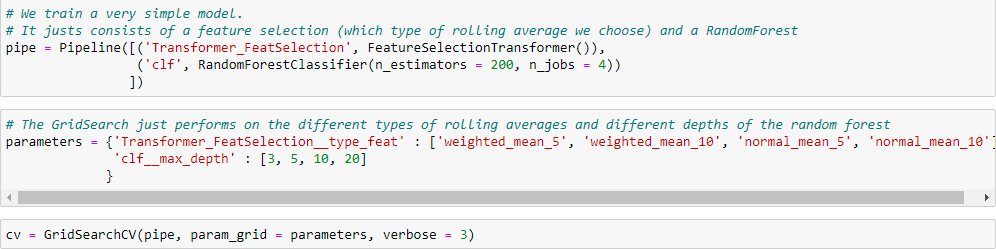

# Does Machine Learning Help to Win a Kind of Football Pool?

## Introduction:

On the occasion of Euro 2020, taking place 2021 because of the pandemic, a kind of football pool took place in our department. Of course, as a data scientist it was my goal to win this competition. I mainly stuck to the odds, and performed well but I did not win. A colleague of mine surpassed me by three points.

Since when I deliberated if I would be more successful using a machine learning approach. Let's find out.

## Description of the Problem:

The kind of football pool took place on the platform [Kicktipp](https://www.kicktipp.de). There are two times of bets you have to make:
- A bet on every single match played in the tournament. For a correct result we obtain four points, for a correct goal difference three points (in case of a draw that is already the correct result), and the right tendency (the correct winner or draw) is worth two points.
- Bets on the winners of the groups, the participants of the semi-finals and the champion of Euro 2020. Each correct guess is worth four points.

I achieved 109 points, 24 of them were bonus points. That's the number of points we have to beat.

## Description of the Approach and Pitfalls

We have to solve several problems to establish a model that solves the stated problem.

### Collecting Data
The first question is: What data do we use? In contrast to other machine learning problems we are not given a dataset, but have to establish the database by ourselves. I decided to take the matches played in the qualifying of Euro 2020, and in the UEFA Nations Leagues 2018/19 and 2020/21 as base. This a very small number of matches for machine learning approach, namely 565 many matches. The problem is that international matches don't take place that often and that I wanted to use data, which is not outdated.

The next question is what features can we use? Fortunately, I found out that for each of these games on the homepage of the UEFA statistics like shots, shots on target, passes, passes completed, and so on are given.

Now, the question is how to collect the data? In Wikipedia we can find the URLs of the matches on the homepage of the UEFA. This allows us to do some web crawling to grab at first the right URLs from Wikpedia, and afterwards to crawl the data from the pages of the UEFA. In order to do this, we use the Python packages *requests* to make get requests and *BeautifulSoup* to parse the HTML code and extract the information we need. Unfortunately, UEFA changed its page design over time (the statistics were moved to a seperate statistics page), which made the crawling process a bit more tedious.

Additionally, we also have to crawl the data regarding the matches played in Euro 2020, since we need them to evaluate the performance of our approach in the end.

### Feature Engineering
When we take a look at the data collected so far, we see that we cannot use them directly to train a model, which allows us to predict the goals in a match. All statistics refer to the match we want to predict. That is, at the time point we want to bet on a match we do not know the statistics of the match. Therefore, we have to perform some *feature engineering*.

We cannot use the statistics of the match we want to predict, but we can use the statistics of the matches a team played in the past. Therefore, we compute for each feature two kinds of rolling averages:
- the average value of the feature in the last five, respectively last ten matches.
- an average with exponentially decreasing weights, such that matches that were played more recently are more important. These averages are calculated again with respect to the last five and respectively ten matches.

### Model Training
Now, we are able to train a model that predicts the goal of a team depending on the performance of the team and the opponent in the past. For the model training we use the library *sklearn*. Our model is based on a simple random forest together with a custom feature selector. Since we have only a limited amount of matches and lots of features (for each statistic four different rolling averages), there is a risk of overfitting. Therefore, we take only features of a fixed rolling average in account. The model is trained using GridSearch, where we take as parameters different depths of the random forest and the different kinds of rolling averages.

It turns out that the model we choose for evaluation in the next step uses the weighted average on the last ten matches.

Now, we have a model that can we use to predict results of the games. But how can this model help us to perform better in Kicktipp? For guessing the single matches we can of course use the result predicted by the model. But, we have an objective function on the possible results (a short reminder: a correct result is worth four points, in case of a win the right goal difference is worth three points, and the right tendency is worth two points). If we choose the result predicted by the model, we choose the result that is most likely. But this result does not necessarily maximizes the number of expected points. Therefore, we use the *predict_proba* method to obtain the probability distribution of the goals scored by each team. Then, using this probability distribution we calculate which result maximizes the expected number of points in Kicktipp.

The second point is how we can use the model for guessing the bets for the bonus points. I use a Monte Carlo simulation, where all the games are simulated randomly according to the probability distribution given by the model. To simulate the tournament I use some *objective programming*, e.g. implementing the groups of the tournament as classes. The implementation of the tournament is a bit tedious, because 24 teams take part in the tournament, which is not a power of two. Therefore, also some best thirds in the groups go to the next state and the schedule depends on which teams qualify for the knockout-phase. Since the simulation of the tournament is relatively slow, we only make 2000 repetions in the Monte Carlo simulation.

## Evaluation and Conclusion

How well does our approach perform? We see in the figure that I achieved 109 points in Kicktipp, where 24 of them were bonus points. The winner obtained 112 points.

Our Monte Carlo simulation suggests as winners of the groups *Italy*, *Belgium*, *Netherlands*, *England*, *Spain*, and *Germany*. As participants of the semi-finals we obtain *Spain*, *Italy*, *Netherlands* and *Germany*, and as champion of the tournament *Spain*. From these guesses six are right (Italy, Belgium, Netherlands and England won their groups, and Italy and Spain reached the semi-finals). That is the same number of points I received from the bonus points. Not bad!

From the betting on single matches we even obtain 89 points. That is in total 113 points. Four points more than I obtained and that would have been enough to win the kind of football pool.

I have to admit that starting this project I had doubts that the approach would work that well. The base for training the model is with only ~550 matches very small. The features only rely on match statistics and don't take into account e.g. the values of the players. Also all bets were made with respect to statistics before the start of the tournament. Moreover, the evaluation set (Euro 2020) consists only of 51 matches. That is, even a very good model may suffer from lots of randomness in the tournament. On the other hand, it can also be the case that we were a bit lucky and training a new model would result in a worse performance. But all in all we can conclude that our approach works remarkably well.