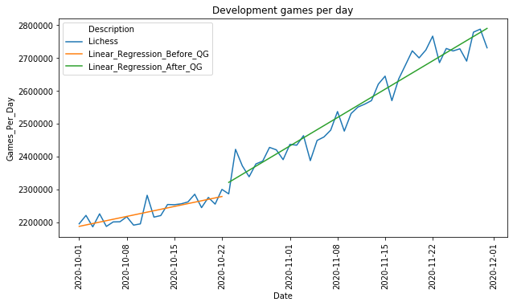
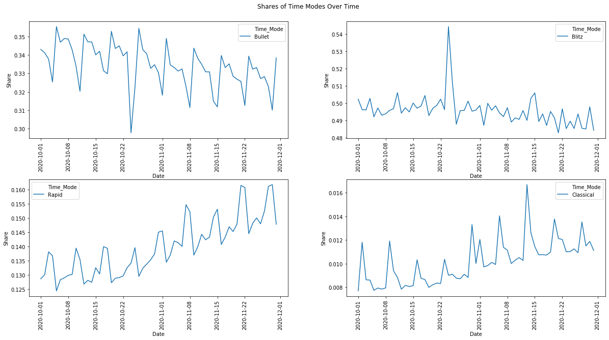

# Does Machine Learning Help to Win a Kind of Football Pool?

Introduction:
------------

On the occasion of Euro 2020, taking place 2021 because of the pandemic, a kind of football pool took place in our department. Of course, as a data scientist it was my goal to win this competition. I mainly stuck to the odds, and performed well but I did not win. A colleague of mine surpassed me by a single point.

Since when I deliberated if I would be more successful using a machine learning approach. Let's find out.

Description of the Problem:
---------------------------
The kind of football pool took place on the platform [Kicktipp](https://www.kicktipp.de). There are two times of bets you have to make:
- A bet on every single match played in the tournament. For a correct result we obtain four points, for a correct goal difference three points (in case of a draw that is already the correct result), and the right tendency (the correct winner or draw) is worth two points.
- Bets on the winners of the groups, the participants of the semi-finals and the champion of Euro 2020. Each correct guess is worth four points.

I achieved 109 points, 24 of them were bonus points. That's the number of points we have to beat.

Description of the Approach and Pitfalls
---------------------------
We have to solve several problems to establish a model that solves the stated problem.

The first question is: What data do we use? In contrast to other machine learning problems we are not given a dataset, but have to establish the database by ourselves. I decided to take the matches played in the qualifying of Euro 2020, and in the UEFA Nations Leagues 2018/19 and 2020/21 as base. This a very small number of matches for machine learning approach, namely 565 many matches. The problem is that international matches don't take place that often and that I wanted to use data, which is not outdated.

The next question is what features can we use? Fortunately, I found out that for each of these games on the homepage of the UEFA statistics like shots, shots on target, passes, passes completed, and so on are given.

Now, the question is how to acquire the data? In Wikipedia we can find the URLs of the matches on the homepage of the UEFA. This allows us to do some web crawling to grab at first the right URLs from Wikpedia, and afterwards to crawl the data from the pages of the UEFA. In order to do this, we use the Python packages *requests* to make get requests and *BeautifulSoup* to parse the HTML code and extract the information we need. Unfortunately, UEFA changed its page design over time (the statistics were moved to a seperate statistics page), which made the crawling process a bit more tedious.

Additionally, we also have to crawl the data regarding the matches played in Euro 2020, since we need them to evaluate the performance of our approach in the end.

When we take a look at the data acquired so far, we see that we cannot use them directly to train a model, which allows us to predict the goals in a match. All statistics refer to the match we want to predict. That is, at the time point we want to bet on a match we do not know the statistics of the match. Therefore, we have to perform some *feature engineering*.

We cannot use the statistics of the match we want to predict, but we can use the statistics of the matches a team played in the past. Therefore, we compute for each feature two kinds of rolling averages:
- the average value of the feature in the last five, respectively last ten matches.
- an average with exponentially decreasing weights, such that matches that were played more recently are more important. These averages are calculated again with respect to the last five and respectively ten matches.

Now, we are able to train a model that predicts the goal of a team depending on the performance of the team and the opponent in the past. In this application we use a simple random forest together a feature selector. Since we have only a limited amount of matches and lots of features (for each statistic four different rolling averages), there is a risk of overfitting. Therefore, we take only features of a fixed rolling average in account. The model is trained using GridSearch, where we take as parameters different depths of the random forest and the different kinds of rolling averages.

The question is how to acquire these data? 

- Where to find the data? Features?
- No classification problem, but optimization problem.
- for bonus points situation is even more complicated -> Monte Carlo Simulation.
- small number of matches...

- UEFA changed its layout

- Definition of the problem
- Analysis through visualizations and data exploration
- Implement algorithms and metrics of your choice, document preprocessing, refinement and post-preprocessing steps
- Collect results about your finding, visualize significant quantities, validate/justify your results.
- Concluding remarks

I learned chess when I was five years old. It didn't take long for me to beat my father and brother. Later on, I joined the local chess club, became an above average player and the game never lost its fascinating character to me. Nevertheless, in my opinion chess always had the reputation of being an activity mostly for nerds.

But in the last year things changed noticeably. Chess, especially online chess gained lots of popularity. In my opinion, there are two events responsible for this development. At first, COVID-19. People played chess online instead face to face. Moreover, very strong players like the world champion Magnus Carlsen started their own online tournaments that attracted public attention. The second reason is Netflix' drama series "The Queen's Gambit". This series is about the orphan Beth who tries to become the best chess player in the world, but also struggles with drug addiction. The name Queen's Gambit comes from a popular chess opening, which is depicted above.

Here, I want to investigate the impact of Queen's Gambit on online chess by analyzing games played on [Lichess](https://lichess.org).

Lichess is one of the most popular platforms for online chess with more than 100.000 players online at the same time and also lots of the world's top players like Magnus Carlsen play there regularly. Moreover, Lichess offers the opportunity to play several different chess variants like *Chess960*, *Crazyhouse* ... and *time modes*.

When you play chess you usually use a chess clock. Each player has a main time and an increment. E.g., the time control 180+2 means, that each player has 180 seconds for the entire game and after each move he receives addional two seconds. The increment has the effect that a player does not run out of time in the end. In the analysis we will consider the time modes *Bullet*, *Blitz*, *Rapid* and *Classical*. In Bullet each player has less than three minutes for the first 40 moves. This is a very fast time mode. To play sound chess in Bullet you have to be a very strong chess player. Blitz is the most popular time mode: Here each player has at most 8 minutes for the first 40 moves. Rapid and Classical are slower time modes, in which each player has less than or at least 25 minutes for the first 40 moves. From my personal experience stronger players prefer playing Bullet or Blitz.

Outline:
------------
We will consider the following questions to investigate the impact of "The Queen's Gambit" on online chess:
-	How did the number of games played develop?
-	Do we observe a change in shares of time modes? This would indicate a change in the mixture of players playing on Lichess.
-	Do we also observe a boost of the popularity of the eponymous chess opening Queen's Gambit?

Procedure:
-------------
All games played on Lichess are available on <https://database.lichess.org/>. Netflix' Queen's Gambit was published on the 23rd of October. I will analyze all games played on Lichess in October and November 2020. That's a lot of data. Unpacking the data from only these two months yields text data of more than 250 GB. I want to perform the data analysis using the *pandas* library written in *Python*. But before being able to analyze the data, several data wrangling steps must be performed: The games are stored in the pgn-format. This is a format which is usually used to store chess games in databases.

Therefore, I do some parsing beforehand. Afterwards, I store the relevant features for the analysis in a csv-file. Unfortunately, these csv-files are still too large to fit in my RAM. Therefore, I cannot use pandas to analyze the data at this point. Instead I categorize the played games into groups (depending e.g., on the time mode, the opening played, the date of the game...) Then, I iterate through the csv-file line by line and check in which group the game belongs. The result is the following compressed dataframe which contains all relevant information for our analysis:

Analysis:
------------
Now, we have everything prepared to consider the questions given in the introduction. We start with the development of played games over time. The series was published on the 23rd of October. Do we see a significant change in the number of daily played games on Lichess? The answer is definitely yes as the following plot shows.

When we look at the linear interpolation of games played before and after the release, we observe a huge difference. Before the release we had a daily increase of approximately 4.300 games per day. After the release there is a daily increase of approximately 12.300 games per day. Moreover, we observe an enormous peak in games played on 24th of October. It is tempting to explain this peak by lots of players that started playing chess inspired by "The Queen's Gambit". Unfortunately, this explanation is wrong. On the 24th of October the Autumn Marathon started. The Marathon tournaments last one day, take place every three months and are very popular on Lichess. So this explains this peak. 

Now, let's take a closer look at the development of the shares of the time modes. From my personal experience weaker players prefer Rapid and Classical - as I already mentioned. That's not surprising since beginner usually have to think longer about their moves. We have seen that the number of games played increased significantly after the release of "The Queen's Gambit". In my opinion it is likely that this increase is caused by many beginners that started to play chess. If this assumption is true, then we should observe that the shares of Bullet and Blitz decrease, but the shares of Rapid and Classical increase. Is this right?

It seems that I'm not mistaken. On the 24th of October we observe again a huge peak in the Blitz mode. The reason for this outlier is the mentioned Autumn Marathon.

We have seen that the Netflix series had clearly an impact on the number of games played on Lichess and also on the mixture of time modes. But does also the opening Queen's Gambit gain more popularity? The answer is yes, but the effect is very small.

Why is the effect only so small? Playing sophisticated openings like the Queen's Gambit requires some sound knowledge about chess. Therefore, many of the new players won't play this opening. The following chart underlines this: The share of the Queen's Gambit increases with the strength of the white player.

Summary and further questions:
------------------------
We investigated the impact of Netflix' Queen's Gambit on online chess by analyzing the games played on the online platform Lichess in October and November 2020. We have seen that we can observe a remarkable effect. Moreover, we noticed that there also exists an impact on the shares of different time modes. My hypothesis is that the reason is a large number of beginners joining Lichess at this point in time. But it would be worth considering this point in more detail, e.g., using the Lichess API to evaluate profile data of each player.

Moreover, it would be interesting to extend the above analysis to the entire year 2020 to measure the effect of COVID-19 in more detail. I would expect that there exists another dramatic increase in daily games in March and April, when several lockdowns took place.