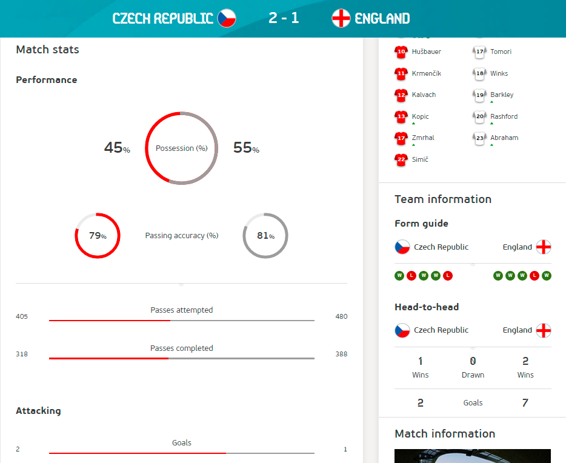
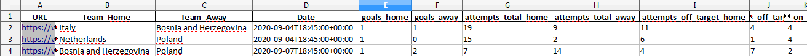
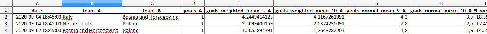
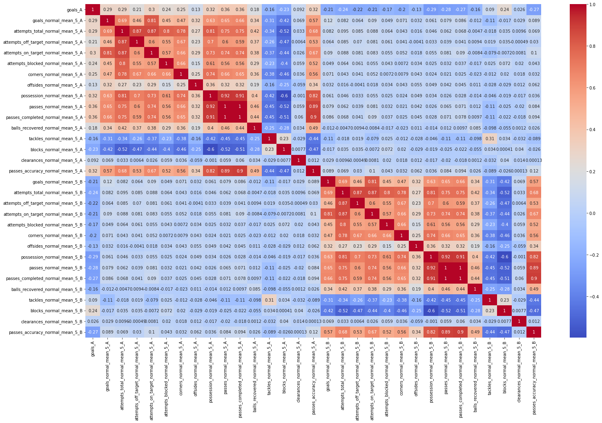
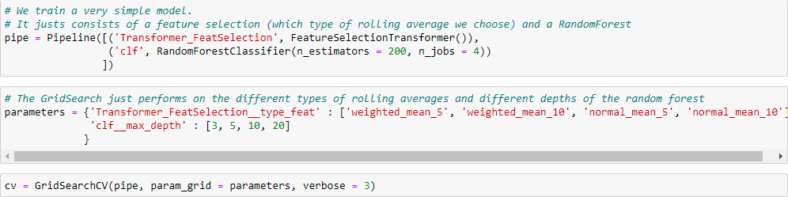
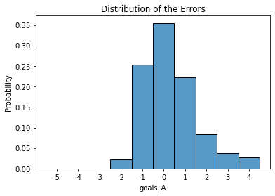

# Does Machine Learning Help to Win a Football Betting Game?

The GitHub repository that contains the code that is needed for this blog post can be found [here](https://astraro.github.io/euro2020/).

## Project Overview
On the occasion of Euro 2020, taking place 2021 because of the pandemic, a football betting game took place in our department. Of course, as a data scientist it was my goal to win this competition. I mainly stuck to the odds, and performed well but I did not win. A colleague of mine surpassed me by three points.

Since then, I deliberated if I would be more successful using a machine learning approach. Let's find out.

The football betting game took place on the platform [Kicktipp](https://www.kicktipp.de). There are two kinds of bets you have to make:
- A bet on every single match played in the tournament. For a correct result we obtain four points, for a correct goal difference three points (in case of a draw that is already the correct result), and the right tendency (the correct winner or draw) is worth two points.
- Bets on the winners of the groups, the participants of the semi-finals and the champion of Euro 2020. Each correct guess is worth four points.

I achieved 109 points, 24 of them were bonus points. That's the number of points we have to beat.

## Problem Statement
To establish a machine learn model that can help us in the betting game, we have to solve several problems:
- At first, we have to establish a database. In order to do this we will collect match statistics of games played in the qualifying of Euro 2020, and in the UEFA Nations Leagues 2018/19 and 2020/21. This is avery small number of matches for a machine learning approach, namely 565 many matches. The problem is that international matches don't take place that often and that I want to use data, which is not outdated.
- We want to train a machine learning model that predicts the number of goals of a team. Then, we use this model to predict the outcome of a match. But after collecting the match statistics (like shots on target, passes completed, ball possession, ...), we cannot use them at once to predict the number of goals scored. All these statistics are unknown to us at the point we have to make our bet. Therefore, in a feature engineering step we compute the rolling (weighted) averages of the statistics based on the matches that took place recently for each team.
- When we have established a model that predicts the number of goals of a team in a match, we still have to find a way to make bets for the bonus points. In order to do this, we use a Monte-Carlo approach: We simulate the course of the tournament several times based on our model. Then, we choose the outcomes that are most likely for our betting game.

## Metrics
We will measure the performance of our machine learning approach in two ways: At first, we measure the performance of the model predicting the number of goals of a team w.r.t. accuracy and L_1-metric. Afterwards, we compare the number of points obtained in the betting game using the guesses based on the model to the number of points I obtained.

## Data Collection
Since we deal with a real-world problem, we are not given with a prepared dataset in the beginning but have to collect the data on our own. As already mentioned, as basis we want to use the matches played in the qualifying of Euro 2020, and in the UEFA Nation Leagues 2018/2019 and 2020/21. Fortunately, for each of the matches you can find statistics (e.g., number of shots, shots on target, passes, passes completed, ball possession) on the homepage of the UEFA.

Now, the question is how to collect the data? In Wikipedia we can find the URLs of the matches on the homepage of the UEFA. This allows us to do some web crawling to grab at first the right URLs from Wikpedia, and afterwards to crawl the data from the pages of the UEFA. In order to do this, we use the Python packages *requests* to make get requests and *BeautifulSoup* to parse the HTML code, and extract the information we need. Unfortunately, UEFA changed its page design over time (the statistics were moved to a seperate statistics page), which made the crawling process a bit more tedious.

Additionally, we also have to crawl the data regarding the matches played in Euro 2020, since we need them to evaluate the performance of our approach in the end. The crawling failed on three matches. We add the information by hand. The good news is that our data is complete, so we don't have to deal with missing values in the future. 

## Feature Engineering
We cannot use the statistics of the match we want to predict, but we can use the statistics of the matches a team played in the past. So we have to perform some feature engineering:  We compute for each feature two kinds of rolling averages:
- the average value of the feature in the last five, respectively last ten matches.
- an average with exponentially decreasing weights, such that matches that were played more recently are more important. These averages are calculated again with respect to the last five and last ten matches, respectively.

## Data Exploration and Visualization
In total our database consists of 565 many matches. Apart from the goals that is our target variable, we have 26 features w.r.t. to four different rolling averages. We do not have missing data, so we don't have to use heuristics to fill up such gaps.

The following heatmap shows the relationship between the target variable and the engineered features according to the average of the last five games played.

We observe some interesting relationships: It is not surprising that the average of goals scored in the past is highly correlated with the number of goals scored in the actual goal. But, the number of attempts on the target, the ball possession and the (completed) passes are even higher correlated. Moreover, we also see a negative correlation to the number of attempts, (completed) passes, and ball possession of the opponent.

## Implementation and Model Evaluation
Now, we are able to train a model that predicts the goals of a team depending on the performance of the team and the opponent in the past. For the model training we use the library *sklearn*. Our model is based on a simple random forest together with a custom feature selector. Since we have only a limited amount of matches and lots of features (for each statistic four different rolling averages), there is a risk of overfitting. Therefore, we take only features of a fixed rolling average into account. The model is trained using *GridSearch*, where we take as parameters different depths of the random forest and the different kinds of rolling averages.

It turns out that the model we choose for evaluation in the next step uses the weighted average on the last ten matches.

On the test set we obtain an accuracy of approximately 0.35, i.e., we predict the number of scored goals by a team in every third match. Looking at the distribution of errors, we see that our model especially underestimates the number of goals. 

That is, in reality we have more often results, where a team scores more goals than our model predicts than vice versa. The mean absolute error is approximately 0.92.

Now, we have a model that can we use to predict results of the games. But how can this model help us to perform better in Kicktipp? For guessing the single matches we can of course use the result predicted by the model. But, we have an objective function on the possible results (a short reminder: a correct result is worth four points, in case of a win the right goal difference is worth three points, and the right tendency is worth two points). If we choose the result predicted by the model, we choose the result that is most likely. But this result does not necessarily maximizes the number of expected points. Therefore, we use the *predict_proba* method to obtain the probability distribution of the goals scored by each team. Then, using this probability distribution we calculate the result, which maximizes the expected number of points in Kicktipp.

The second point is how we can use the model for guessing the bets for the bonus points. I use a *Monte Carlo simulation*, where all the games are simulated randomly according to the probability distribution given by the model. To simulate the tournament I use some *objective programming*, e.g. implementing the groups of the tournament as classes. The implementation of the tournament is a bit tedious, because 24 teams take part in the tournament, which is not a power of two. Therefore, also some best thirds in the groups go to the next stage and the pairings depend on which teams qualify for the knockout-phase. Since the simulation of the tournament is relatively slow, we only make 5000 repetions in the Monte Carlo simulation.

From the betting on single matches we obtain 79 points, and we guess right four winners of the groups and one participant of the semi-final. In total that are 99 points. That is a solid result, but 10 points less than I obtained.

24 That is in total 113 points. Four points more than I obtained and that would have been enough to win the kind of football pool.

## Reflection and Improvement
We see that we fail on improving the result in the football betting game using machine learning. But, the approach works well and the number of points we would have obtained is not that far away from the top. Moreover, we have to remember that a football tournament is a very random event. That is, even in the case of a perfect model, it can happen that the performance is poor.

There are several directions for improving the model:
- We use only a very simple machine learning model. Perhaps, using a more advanced model and putting more effort on parameter tuning would result in a better performance.
- We could take more variables into account, e.g., the values of the players.
- All predictions were made on the performance before the tournament. Spending more time, it would also be possible to take the matches played at the tournament into account. Then, also trends in the tournament are reflected.